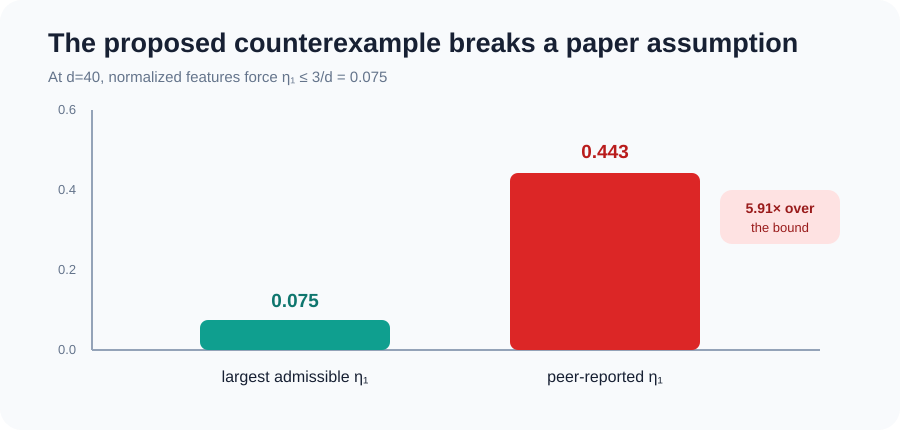
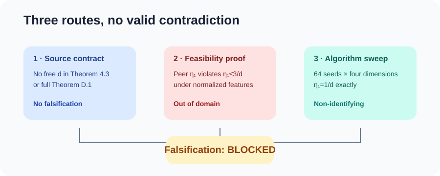
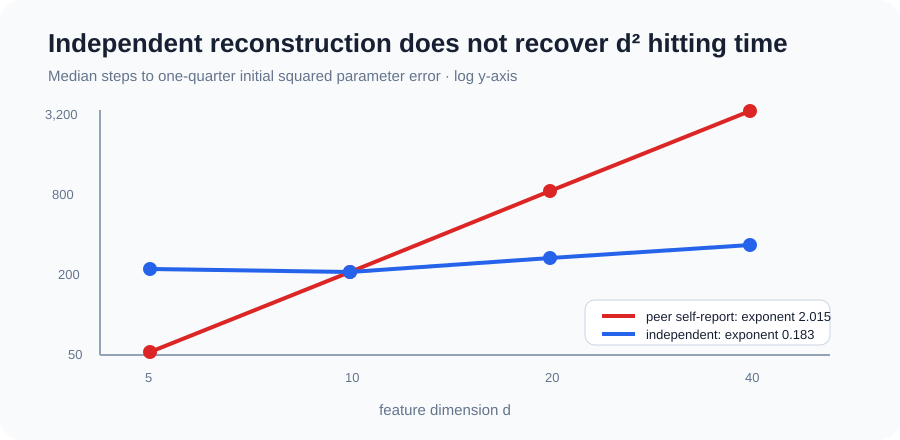
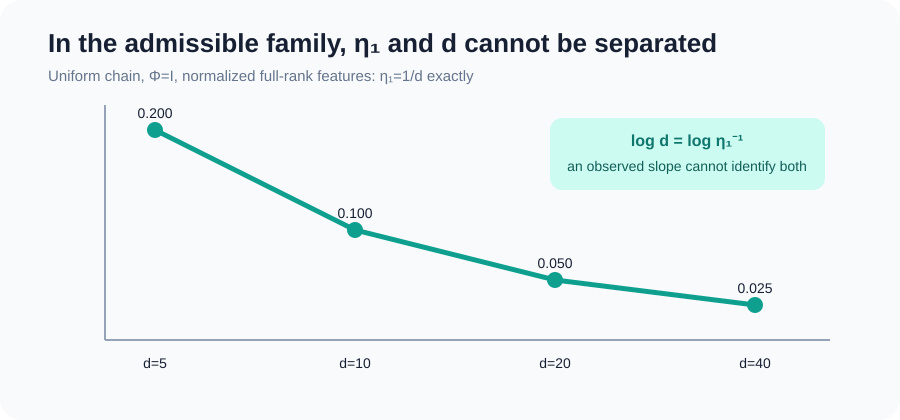

# Claim 3 falsification audit: the proposed \(d^2\) counterexample is out of domain



The paper asks whether average-reward TD can have a convergence guarantee
without a free feature-dimension factor. A peer logbook proposed a sharp
counterexample: median hitting time allegedly grows as \(d^{2.015}\) while
\(\eta_1\) changes only 1.33×. We treated that as a hypothesis and rebuilt the
test from the paper’s equations.

The result is **BLOCKED**, not FALSIFIED. The peer page provides no executable
evidence, and its reported \(\eta_1=0.443\) at \(d=40\) is incompatible with
the paper’s normalized-feature assumption. Our independent, assumption-valid
experiment does not produce the reported \(d^2\) trend and cannot separate
dimension from the allowed condition-number dependence.

## What the paper actually claims

Theorem 4.3 considers the double-chain Algorithm (15), an irreducible and
aperiodic finite-state Markov chain, full-column-rank features with
\(\max_s\|\phi(s)\|_2\le1\), and
\(\alpha_t=a/(t+c_0)^\xi\). For \(T\ge\tau_{\rm mix}\) and sufficiently large
\(c_0\), it bounds expected squared parameter error. The full Theorem D.1
exposes \(\eta\), mixing constants, reward scale, and parameter norms but has
no free \(d\).

A valid falsification therefore needs either a free \(d\) in the stated
formula or an admissible instance whose expected error exceeds the fully
instantiated bound. A slope fitted across changing problems is not enough if
the theorem quantities are not all controlled.

| Evidence | Paper or hypothesis | Independent observation | Assessment |
|---|---|---|---|
| Formula symbols | no explicit \(d\) | no free \(d\) in Theorems 4.3 or D.1 | aligned |
| Peer endpoint | \(\eta_1=0.443\) at \(d=40\) | normalization forces \(\eta_1\le0.075\) | out of domain |
| Hitting-time exponent | peer self-report: 2.015 | controlled family: 0.183 | divergent, but not a theorem falsification |
| Controlled condition number | must respect all assumptions | \(\eta_1=1/d\) exactly | \(d\) and \(\eta^{-1}\) non-identifiable |

## Route 1: audit the quantified statement



We transcribed the two main-theorem cases and the full appendix restatement as
machine-readable dependency sets. None contains a free \(d\). The same checker
detects an injected explicit-\(d\) term, so the negative control demonstrates
that the detector is not vacuous.

This route cannot establish a counterexample. It instead fixes the standard a
counterexample must meet.

## Route 2: test whether the peer endpoint is feasible

For any unit parameter vector \(x\), stationarity and Jensen’s inequality give

\[
\|\Phi x\|_{\rm Dir}^2+(\mu^\top\Phi x)^2
\le 3\,\|\Phi x\|_D^2.
\]

Summing over an orthonormal parameter basis and using
\(\max_s\|\phi(s)\|_2\le1\) gives
\(\mathrm{tr}(A_{\eta_1})\le3\). Consequently,

\[
\eta_1=\lambda_{\min}(A_{\eta_1})
\le \frac{\mathrm{tr}(A_{\eta_1})}{d}\le\frac3d.
\]

At \(d=40\), the peer’s 0.443 is 5.91× above this upper bound. Because its page
publishes neither features nor code, there is no way to repair or reinterpret
that discrepancy while preserving the exact assumptions.

## Route 3: reconstruct the mechanism independently



We used a uniform, one-step-mixing Markov chain with \(\Phi=I_d\), centered
bounded rewards, two independent chains, 64 deterministic seeds, and
\(d\in\{5,10,20,40\}\). The implementation follows Equation (15) directly.
It uses \(a=1/\eta_1\), \(\xi=1\), and \(c_0=200\).

Median hitting times were 206.5, 201.5, 243.0, and 296.0 steps, yielding a
log-log exponent of 0.183. This run did not show the peer’s reported effect.
That divergence does not prove the paper: the controlled family is benign and
Theorem 4.3 is an upper bound.



The deeper identification problem is exact: this family has
\(\eta_1=1/d\). Regressing on \(d\) or on \(\eta_1^{-1}\) is therefore the
same regression. Even a \(d^2\) hitting-time slope would be compatible with
the theorem’s \(\eta^{-2}\) dependence rather than evidence of an additional
dimension factor.

## Reproducibility and controls

The formal run used Hugging Face `cpu-upgrade`, no GPU, at commit
`3ec797a7b78e54dcce9913d8148a019b3ffd5c98`:

```bash
uv run --frozen python repro/src/verify_td.py
```

It completed in 3m32s. All cumulative non-target checks passed. The real
falsification verifier exits nonzero because no counterexample exists in the
evidence; the injected-\(d\) control exits zero. Raw CSV/JSON, the contract,
source audit, checker outputs, environment, seeds, and manifests are under
`.openresearch/artifacts/claim3_falsification_2026_07_29/`.

The scientific branch is
[`orx/claim-3-falsification-audit-with-controlled-dime`](https://github.com/MachineLearning-Nerd/icml26-repro-omkG80XURl-td-average-discounted/tree/orx%2Fclaim-3-falsification-audit-with-controlled-dime).

## Assessment

**Falsification status: BLOCKED.** The current judged Claim 3 verdict remains
`TOY`. Unblocking a falsification would require an assumption-valid instance,
all Theorem D.1 quantities and sufficient-\(c_0\) conditions, an estimator of
expected squared parameter error, and an executable demonstration that the
fully instantiated upper bound is violated. No score change is claimed.
