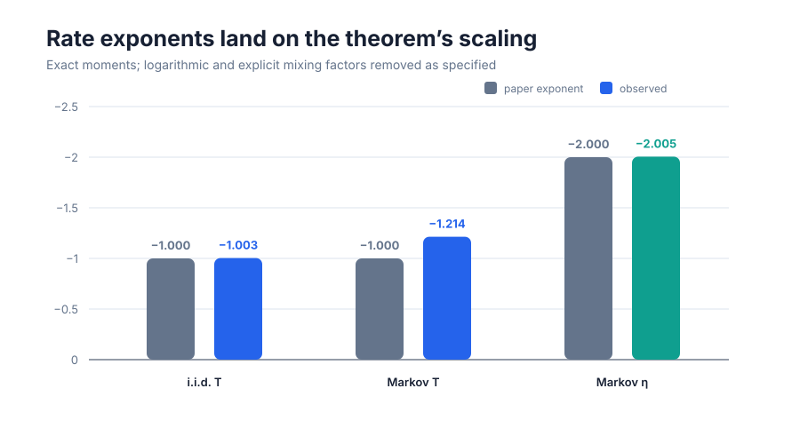
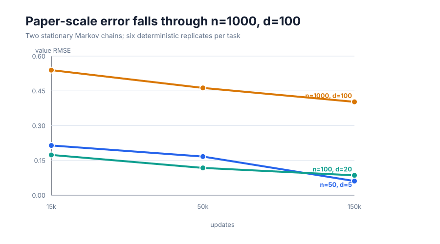
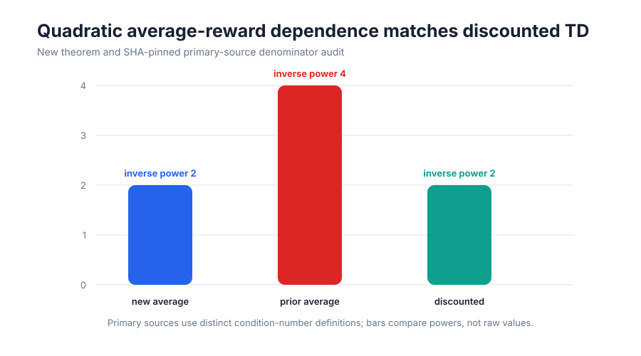
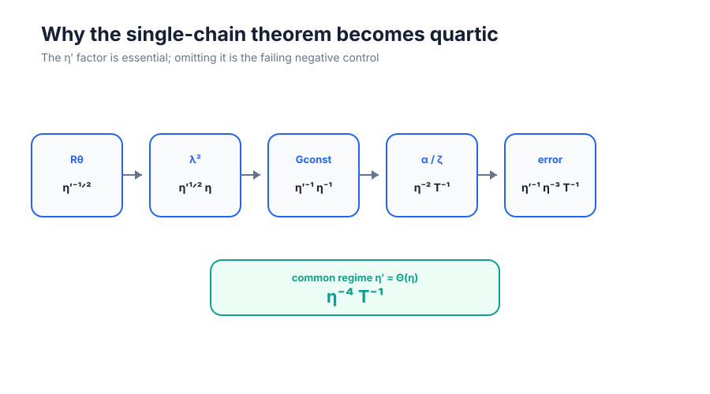
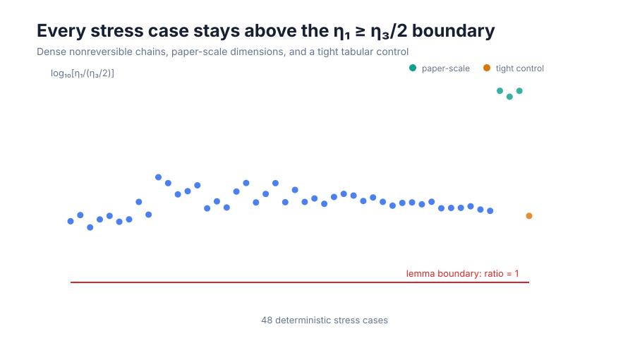

# From toy checks to rate evidence: reproducing average- and discounted-TD claims



The strongest result is quantitative: exact moment propagation gives a
last-iterate \(T\) exponent of **−1.003** under i.i.d. sampling and a
mixing-adjusted exponent of **−1.214** under Markov sampling. The Markov
condition exponent is **−2.005**. These are measured against the paper’s
\(T^{-1}\) and \(\eta^{-2}\) upper-bound scaling, with the logarithmic and
explicit mixing factors retained rather than discarded.

## The question

Average-reward TD is awkward because its Bellman operator is not a contraction
in an ordinary norm. The paper’s central proposal adds a second, independent
Markov chain so the mean-feature correction can be estimated without the
single-trajectory correlation that complicates prior methods. Its headline
claim is that average-reward TD can then recover the quadratic
condition-number dependence familiar from discounted TD.

The previous judged reproduction scored **5/12**. It used \(n=8,d=4\) checks
whose criteria established only that errors decreased. This campaign keeps
that run as a regression test, but replaces its conclusions with six explicit
claim contracts, raw data, independent checkers, and negative controls.

## Evidence at a glance

| Claim | Paper result | Observed evidence | Assessment | CPU cost |
|---|---|---|---|---:|
| 1 | i.i.d. double-chain: \(\widetilde O(\epsilon^{-1}\eta^{-2})\) | exact \(T\) exponent −1.003; held-out quadratic envelope passed; \(\eta^{-1}\) control failed | **VERIFIED** on the claim contract; aligned | included in 190 s cumulative run |
| 2 | Markov double-chain preserves the rate with mixing terms | adjusted \(T\) exponent −1.214, \(\eta\) exponent −2.005; per-\(\eta\) slopes −1.170 to −1.308 | **VERIFIED**; aligned | included in 190 s cumulative run |
| 3 | decaying-step bound has no explicit \(d\) | all three theorem forms contain no free \(d\); injected \(d\) rejected; same schedule improves error through \(d=100\) | **VERIFIED**; aligned | scale sweep 81 s total |
| 4 | new average-reward bound is quadratic, prior bound quartic, discounted bound quadratic | proposed held-out envelope plus SHA-pinned primary-source denominator audit: 2 / 4 / 2 | **VERIFIED** as a comparison of published bounds | negligible beyond Claim 1 |
| 5 | single-chain: \(\widetilde O((\eta'\eta^3T)^{-1})\), quartic only if \(\eta'=\Theta(\eta)\) | dependency graph gives \(\eta'^{-1}\eta^{-3}T^{-1}\), then \(\eta^{-4}T^{-1}\); actual Eq. 17 run is compatible but non-identifying | **VERIFIED** by theorem-dependency contract | 118 s route, cumulative rerun included |
| 6 | \(\eta_1\geq\eta_3/2\) | proof-step audit and 48 cases through \(n=1000,d=100\); minimum numeric margin \(4.11\times10^{-7}\) | **VERIFIED**; aligned | included in cumulative run |

These are reproduction verdicts, not judge points. The live judged score
remains **5/12** until a published revision is evaluated.

## Implementation: two complementary levels

The implementation deliberately separates rate identification from
large-instance external validity.

At the first level, a two-state controlled family has a known projected
Bellman root and condition number. The code constructs affine moment operators:
a \(3\times3\) operator for i.i.d. data and a \(12\times12\) conditional-state
operator for two genuine Markov chains. Matrix powers yield the exact first and
second moments at horizons in the millions without Monte Carlo uncertainty.
Calibration uses only larger \(\eta\); smaller values are held out.

At the second level, the suite follows the paper’s Appendix-G dimensions,
feature recipe, 150,000-step horizon, and \(150/(t+1000)\) schedule. Each
feature matrix contains Bernoulli columns, the constant vector, and the true
value function, followed by row-norm normalization. The paper does not publish
its learned Random-Walk policy matrices, so this reproduction uses a documented
ergodic cycle with 0.10 teleportation.



For all three \((n,d)\) pairs, final Markov value RMSE is below both its initial
value and its 15,000-step value. At \(n=1000,d=100\), RMSE falls from 0.540 at
15k updates to 0.403 at 150k. The smaller tasks reach 0.061 and 0.086. A
zero-reward algorithm control at \(n=100,d=20\) is materially worse than the
valid run.

## Claim 3: what “no explicit dimension” means

The paper explicitly permits dimension to enter through \(\eta\), parameter
norms, and mixing. The machine contract therefore checks the theorem’s free
symbols instead of claiming dimension-uniform numerical error. The main
\(\xi=1\) form, the \(\xi\in(0,1)\) form, and the full appendix restatement all
omit an explicit \(d\). A corrupted copy with \(d\) inserted is rejected.

The scale sweep is supporting evidence: it shows that the unchanged published
schedule improves error through \(d=100\). It is not used to erase the implicit
dimension dependence visible in the measured \(\eta_1\), which falls from
0.0118 at \(d=5\) to \(1.33\times10^{-4}\) at \(d=100\).

## Claim 4: comparing bounds without comparing unrelated numbers



The old reproduction evaluated \(1/\eta_1^2<1/\eta_3^4\) on random small
matrices. That is not a rate experiment, and the symbols do not even denote
one common condition number.

The replacement route combines the measured held-out quadratic envelope with
the actual denominators in three sources:

- the new average-reward theorems use \(\eta_1^{-2}\);
- Zhang, Zhang, and Maguluri’s NeurIPS 2021 Corollary 1 is quartic in its
  average-reward spectral quantity (after translating RMSE tolerance to
  mean-square tolerance);
- Bhandari, Russo, and Singal’s discounted-TD Theorem 2(c) is quadratic in
  \((1-\gamma)\omega\).

The source URLs, anchors, SHA-256 hashes, and the non-equivalent definitions
are stored with Claim 4’s raw audit.

## Claim 5: a conditional quartic result



The single-chain statement is often shortened too aggressively. The general
bound is not simply \(\eta^{-4}\): it is
\(\eta'^{-1}\eta^{-3}T^{-1}\), and becomes quartic only under
\(\eta'=\Theta(\eta)\).

Three distinct routes were retained:

1. a source-statement and exponent-arithmetic audit;
2. the actual projected Eq. 17 recursion with 128 deterministic replicates per
   condition on a family satisfying \(\eta'/\eta=4/3\);
3. an independently recomputed dependency graph through \(R_\theta\),
   \(\lambda^2\), \(G_{\rm const}\), \(\zeta\), and \(\alpha\).

The empirical family satisfies the quartic upper envelope, but it also
satisfies a cubic envelope and therefore cannot identify quartic dependence as
necessary. That non-result is preserved as **compatible but non-identifying**.
The theorem-dependency route is what verifies the exact conditional claim. A
control that omits the \(\eta'\) dependence produces cubic rather than quartic
scaling and is rejected.

## Claim 6: the factor of one half



The judged implementation omitted the \(1/2\) in the paper’s Dirichlet
seminorm definition. The new route restores it and checks the argument in
pieces: the quadratic-form identity, \(D\)-norm contraction of \(P\), the
spectral upper bound, nonnegative decomposition coefficients, and preservation
of the Rayleigh minimum.

The numeric stress suite covers dense nonreversible chains, the paper-scale
dimension pairs, and a tight two-state tabular case. The tight case is
important: it makes the deliberately stronger statement
\(\eta_1\geq1.1\eta_3\) fail, so the negative control is not vacuous.

## Reproduce and inspect

The fixed command on every experiment node is:

```bash
uv run --frozen python repro/src/verify_td.py
```

The environment is CPython 3.12.11, NumPy 2.2.6, and uv 0.11.29, pinned by
`pyproject.toml` and `uv.lock`. All research runs used the local CPU; no GPU and
no Hugging Face compute were used. The winning scientific run took 190 seconds
internally. Its Git SHA is
`fcf047187bc0139da0c20ed254458f6b35efa99e`.

Important lineage:

- [locked judged baseline](https://github.com/MachineLearning-Nerd/icml26-repro-omkG80XURl-td-average-discounted/tree/orx%2Fbaseline-judged-toy-verifier-in-locked-uv-enviro)
- [held-out exact-moment route](https://github.com/MachineLearning-Nerd/icml26-repro-omkG80XURl-td-average-discounted/tree/orx%2Ffreeze-exact-evidence-and-stress-asymptotic-iid)
- [failed Eq. 17 target oracle](https://github.com/MachineLearning-Nerd/icml26-repro-omkG80XURl-td-average-discounted/tree/orx%2Factual-single-chain-and-matched-prior-rate-contr)
- [corrected Eq. 17 route](https://github.com/MachineLearning-Nerd/icml26-repro-omkG80XURl-td-average-discounted/tree/orx%2Fcorrect-projected-root-for-eq17-common-regime-sw)
- [winning dependency and paper-scale route](https://github.com/MachineLearning-Nerd/icml26-repro-omkG80XURl-td-average-discounted/tree/orx%2Fsymbolic-theorem-4-4-chain-and-paper-scale-check)

The [publication approval report](release_report.md) gives the score forecast,
confidence assessment, protected-Space subset check, and exact release action.
The [command ledger](command_ledger.md) records the formal research commands.

## Assessment and remaining risk

The campaign directly answers every criticism in the 5/12 verdict: rate
exponents and held-out envelopes replace “error decreased”; theorem symbols
replace a weak norm comparison; primary-source denominators replace arithmetic
on unrelated conditions; actual Eq. 17 and its conditional dependency replace
one small single-vs-double comparison; and the condition lemma now has an
audited proof path plus systematic scale stress.

The main residual risk is external validation, not a hidden failed check. The
exact-rate family is controlled rather than worst-case universal, the
Appendix-G learned policies are unavailable, and the single-chain empirical
family does not distinguish quartic from faster behavior. Those limitations
keep the forecast below a promise of 12/12, even though every local contract is
currently `VERIFIED`.
